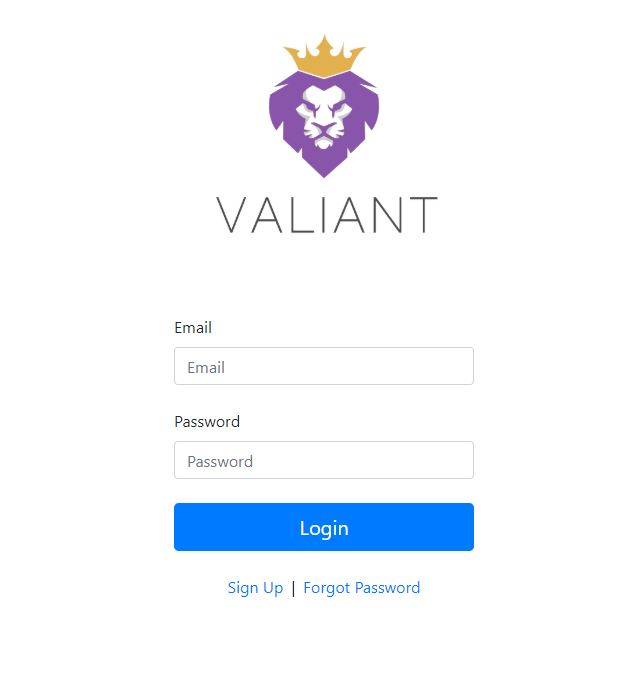
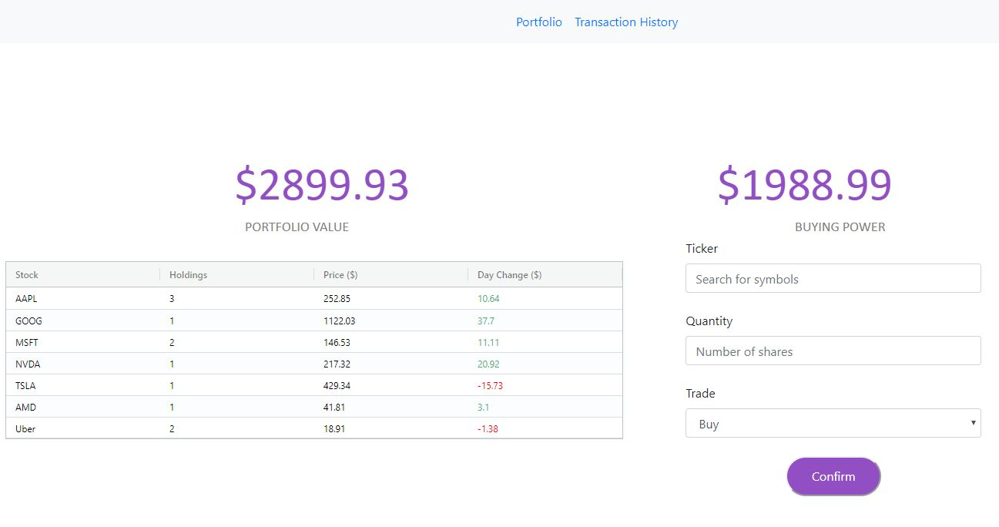
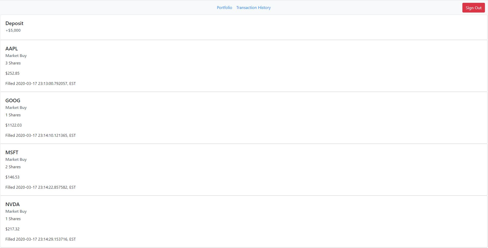
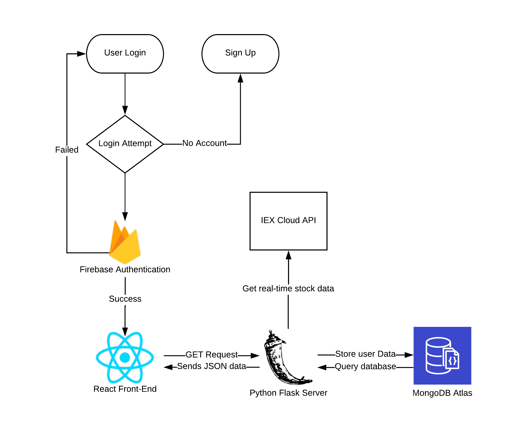

# VALIANT: A Web-based Stock Portfolio Trading Platform

With Valiant, a user is able to create an account, login and start trading with stocks available on the U.S. Stock Market. On the profile page, there is a grid that shows the user's Stocks, Holdings, Current Price, and Day Change. There is also an interface for the user to buy or sell stocks given the stock symbol and the quantity of shares. The transaction history page displays a log of all actions made by the user of the platform.

  
  
  

### Built with

* **Python** 3.7.7

* **Front-end:** Reactjs

* **Back-end:** Python Flask

* **Database:** MongoDB Atlas

* **Authentication:** Firebase

### System Diagram:

  

I used Flask as a REST API with React consuming the API by sending HTTP requests to it. On Flask, I had various endpoints that would return data in a JSON format to React when fetched. This data would then be displayed in a corresponding format on the front-end. 

I chose to use MongoDB Atlas for the database due to the fact that it is a noSQL database, which is easier to scale with lots of data and is faster for most operations than say mySQL or PostgreSQL. MongoDB is responsible for sending the correct data to the front-end depending on the user who is signed in.

Firebase provides an easy way to store and authenticate active users. This helped save time to work on other features of the web platform. It also allowed us to be able to receive analytical and demographical information of our users.

### Dependencies added 

npm install --save firebase

npm install --save react-router

npm install react-router-dom

npm install bootstrap

npm install reactstrap

npm install --save ag-grid-community ag-grid-react react-dom-factories

### Current pip is version 19.2.3
pip install flask

pip install pymongo

pip install pymongo[srv]

pip install python-dotenv

pip install -U flask-cors

pip install requests
